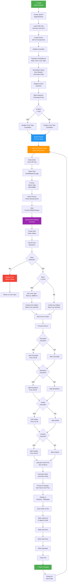

# Ice Cream Parlor - Complete System Flowchart

```mermaid
graph TD
    A["🚀 START<br/>main() Method"] --> B["Create JavaFX<br/>Stage/Window"]
    B --> C["Load FXML File<br/>icecream-view.fxml"]
    C --> D["Create Scene<br/>with UI Components"]
    D --> E["Initialize Controller"]
    
    E --> F["Populate ComboBoxes<br/>Base, Size, Cone Type"]
    F --> G["Set Default Values<br/>Size=Medium<br/>ConeType=Plain"]
    G --> H["Register Event<br/>Listeners"]
    
    H --> I["Base Selection<br/>onChange Event"]
    I --> J{Is Base<br/>= Cup?}
    J -->|YES| K["Disable Cone Type<br/>ComboBox"]
    J -->|NO| L["Enable Cone Type<br/>ComboBox"]
    K --> M["System Ready<br/>for User Input"]
    L --> M
    
    M --> N["👤 USER INTERACTIONS<br/>Select Preferences"]
    N --> O["Select Base<br/>Cone OR Cup"]
    O --> P["Select Size<br/>Small/Medium/Large"]
    P --> Q["If Cone:<br/>Select Type<br/>Plain/Waffle"]
    Q --> R["Select Flavors<br/>Check desired boxes"]
    R --> S["Click<br/>PLACE ORDER Button"]
    
    S --> T["placeOrder() Method<br/>Executes"]
    T --> U["Create New<br/>Order Object"]
    U --> V["Get All User<br/>Selections"]
    
    V --> W{Base<br/>Selected?}
    W -->|NO| X["Display Error:<br/>Select a Base"]
    X --> Y["Return to User Input"]
    
    W -->|YES| Z{Base<br/>= Cone?}
    
    Z -->|YES| AA["Get Cone Type<br/>Plain=p, Waffle=w"]
    AA --> AB["Create Cone Object<br/>Base Cone selected"]
    AB --> AC["Add Cone to Order"]
    
    Z -->|NO| AD["Create Cup Object<br/>Base Cup selected"]
    AD --> AC
    
    AC --> AE["Process Flavors"]
    
    AE --> AF{Chocolate<br/>Checked?}
    AF -->|YES| AG["Add Chocolate<br/>Price: $2.00"]
    AF -->|NO| AH["Skip Chocolate"]
    AG --> AI{Strawberry<br/>Checked?}
    AH --> AI
    
    AI -->|YES| AJ["Add Strawberry<br/>Price: $2.50"]
    AI -->|NO| AK["Skip Strawberry"]
    AJ --> AL{Vanilla<br/>Checked?}
    AK --> AL
    
    AL -->|YES| AM["Add Vanilla<br/>Price: $1.50"]
    AL -->|NO| AN["Skip Vanilla"]
    AM --> AO{Cookies<br/>Checked?}
    AN --> AO
    
    AO -->|YES| AP["Add Cookies<br/>Price: $3.00"]
    AO -->|NO| AQ["Skip Cookies"]
    AP --> AR["Calculate Total Price<br/>Sum all items"]
    AQ --> AR
    
    AR --> AS["Generate Order<br/>Summary String"]
    AS --> AT["Format for Display:<br/>Item Name Size Price"]
    AT --> AU["Display in<br/>TextArea - billDisplay"]
    
    AU --> AV["Save Order to File"]
    AV --> AW["Open orders.txt<br/>in append mode"]
    AW --> AX["Write each item"]
    AX --> AY["Write Total Price"]
    AY --> AZ["Write Separator"]
    AZ --> BA["Close File"]
    
    BA --> BB["✅ Order Complete"]
    BB --> CC["Ready for<br/>Next Order"]
    CC --> N
    
    style A fill:#4CAF50,stroke:#2E7D32,color:#fff
    style M fill:#2196F3,stroke:#1565C0,color:#fff
    style N fill:#FF9800,stroke:#E65100,color:#fff
    style BB fill:#4CAF50,stroke:#2E7D32,color:#fff
    style X fill:#F44336,stroke:#C62828,color:#fff
    style T fill:#9C27B0,stroke:#6A1B9A,color:#fff
```